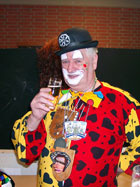

<figure style="float: right; width: 190px; margin: 0 0 1rem 1.5rem;">
  
  <figcaption>Willi Katzenberger</figcaption>
</figure>

## Die Renngemeinschaft de Schörjer

1960 wurde die Renngemeinschaft de Schörjer zumindest offiziell gegründet. "Jeck waren wir ja schon immer", meint Willi Katzenberger. Er ist das einzige noch lebende Gründungsmitglied und seit vielen Jahren unser Ehrenvorsitzender.
Trotz seines recht hohen Alters, hat er noch lange mit auf der Bühne gestanden. Und auch jetzt steht er uns noch immer mit Rat und Tat zur Seite. Er weiß einfach alles über unseren Verein und sein Herz hängt wie eh und je an den Schörjern.
Zu den wichtigsten Personen die uns Schörjer gegründet haben, gehören unter anderem Hans Völl, Walter Ratzwill und Willi Königstein. Begonnen hat alles in der Gaststätte Euterbeck (Kückstraße, Nähe Gaststätte/Hotel Keller). Dort fand man sich zusammen und hat unseren schönen Verein gegründet.

Der Begriff **"Renngemeinschaft"** resultiert aus den legendären **Schubkarrenrennen**, den so genannten "Schürskarren". "Da ging es immer zur Sache und es hat einfach nur Spaß gemacht," so Willi Katzenberger. "Der Sieger bekam damals immer einen Schnaps und eine Blutwurst. Für die damalige Zeit ein überaus lukrativer Preis."



Die ersten Veranstaltungen fanden etwa um 1963 bei "Krichel" statt. Bis man dann irgendwann in den Saal "Jorias" wechselte und dort Jahre lang "hängen" blieb. Durch das Programm damals führte zunächst Ingo Schäfer, der heute in Baesweiler ein Sportgeschäft mit seiner Familie betreibt. "Der Ingo hatte das drauf, der konnte einen Saal zum Kochen bringen", erinnert sich Willi Katzenberger. Aber auch Herbert Geller konnte mit dem Mikrofon umgehen und hat Jahre lang durch das Programm der Schörjersitzungen- und Bälle geführt.

Bis etwa Ende der 70er bzw. Anfang der 80er- Jahre führte Willi Katzenberger die Schörjer mit anderen "Jecken" an seiner Seite durch die Sessionen. Abgelöst wurde er dann durch Dieter Hummes, der bis Anfang der 90er Jahre den Vorsitz im Verein innehatte. Danach wurde Manfred „Manni“ Maar 1. Vorsitzender der Renngemeinschaft, welcher mitte des letzten Jahrzehnts das Amt nach und nach an den neuen 1. Vorsitzende Stefan Latten abgab, welcher auch noch Aktuell 1. Vorsitzender ist.

Man muss einfach anmerken, dass alle genannten Personen und Mitglieder dazu beigetragen haben, dass die Schörjer auch heute noch existieren und den **Brauchtum Karneval so feiern, wie es früher einmal war**.

Unsere **Schörjersitzung** im Januar und das dazugehörige Programm werden aus eigenen Kräften gemeistert, alles ist sozusagen "hausgemacht". Wir haben einfach noch Typen, die sich gerne auf die Bühne stellen und wie wir sagen: "Jecke Seek" machen wollen. Unsere Showtanzgruppe schafft es immer wieder, neue Tänze auf die Bühne zu zaubern, die die Zuschauer und auch uns begeistern und noch lange in Erinnerung bleiben.
Der Typische Schörjerball am Tulpensonntag hat zwar heute kein Programm mehr, ist aber immer noch eine schöne Feier am Tulpensonntag die keiner in Baesweiler verpassen sollte!

Wir Schörjer sind einfach stolz darauf, dass wir so sind, wie wir sind, denn unser **Motto** lautet: **"MIR SIND JECK UND JECKER!"**

Nun haben Sie die Möglichkeit, sich einen Eindruck von unserem Verein zu verschaffen!

Viel Spaß!

### Schörjer ALAU!!!!